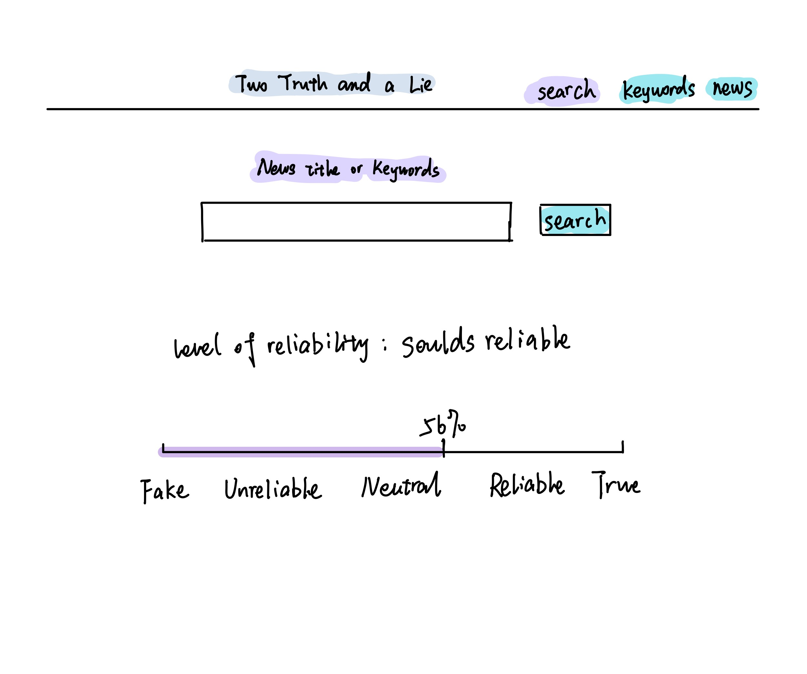
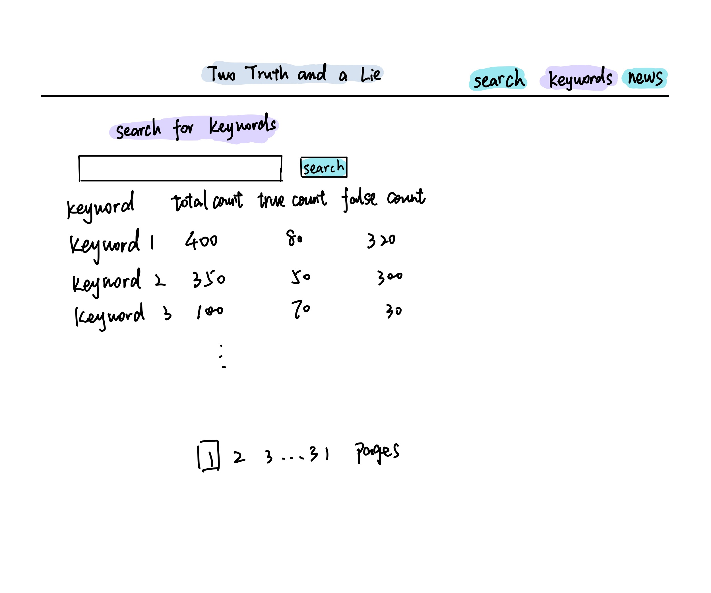
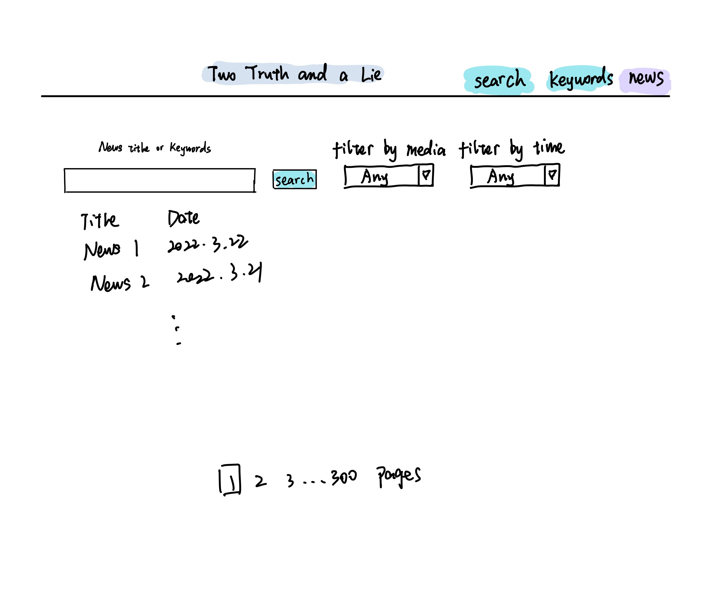
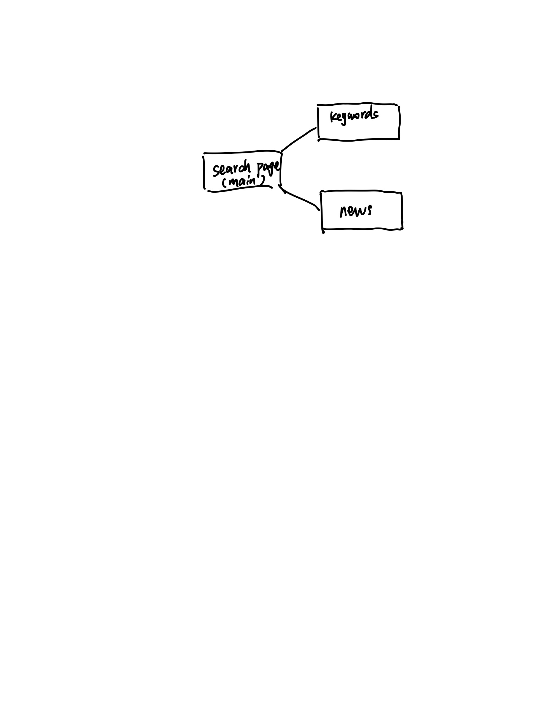

# Two Truths and a Lie

## Overview


In recent years, we can easily notice that misinformation and disinformation are everywhere in our lives. In particular, we can see in Russian-Ukraine war, fake news have been produced and had a great impact on people around the world. People need an easy-to-use fact checking tool to help them to verify the information they received. 

Two Truths and a Lie is a fact checking website that ask users to input the title of the news or keywords of the news to check. Then, it uses its built-in tool to search the input in different sources. Then, it will give an outcome indicates the reliability of the news title/ keywords. After displaying the result, the website will store the result in the database (MongoDB). So that, the user could refer to the top searching inputs (keywords) and results, which would also helps the checking model to be more accurate.


## Data Model


The application will store Keyword, total count of the word, the count of reliable news with this keyword, the count of fake news with this keyword

* keyword acts as the key in key-value pairs. This attribute will be used to find the items in {keyword, total_count, true_count, false_count} form
* for every keyword, there would be the count of the word in reliable news and unreliable news
* There is also an object type called "News", store the data of each piece of news.

An Example Keyword:

```javascript
{
    keyword: "zelensky",
    total_count: 214,
}
```

An Example News Items:

```javascript
{
  title: "At least 8 killed by Russian missile attack on Kyiv shopping mall (PHOTOS)",
  source: "Kyiv Independent",
  keywords: [
    "killed",
    "Russian", 
    "missile",
    "attack",
    "kyiv",
    "shopping",
    "mall",
    "photo",    
  ],
  date: 2022-03-21,
}
```


## [Link to Commented First Draft Schema](db.js) 


## Wireframes

/search - page for searching



/db/keywords - page for showing all the keywords with their counts



/db/news - page for showing all the news in the database



## Site map



## User Stories or Use Cases


1. as a user, I can check if the news or article I saw is reliable
2. as a user, I can see the trend of fact checking keywords and news
3. as a user, I can view all the keywords in the database
4. as a user, I can view all the news in the database

## Research Topics

* (3 points) Use Gulp to animate Sass preprocesser
* (2 points) Use Sass as CSS preprocesser
    * I use Sass to develop the front-end part
* (3 points) external api for search
  * I have used an news API, which is very useful, and I spend a lot of time on it.
* (4 points) client-side JavaScript library
  * I have used Chart.js

11 points total out of 8 required points 


## Link to Initial Main Project File
[app.js](app.js)

## Annotations / References Used

(__TODO__: list any tutorials/references/etc. that you've based your code off of_)

1. [Introduction on News API](https://newsapi.org/docs)
2. [Chart.js](https://www.chartjs.org/docs/latest/)
3. [Gulp](https://gulpjs.com/)
4. [Sass](https://sass-lang.com/)

